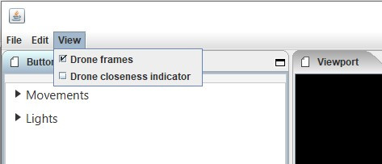

============================
Actions
============================

*In this submenu you have the options to add motion functions and color effects to your design. First, on the home page, select the clip you want to edit => right mouse button => edit actions.*

  .. image:: images/edit_actions.jpg

Menu bar
========

*The menu bar contains functions related to saving and closing files, undo operations and security settings.*

File
----

:Save: To save your layout.
:Close: To close the edit actions submenu

Edit
-----

:Undo: Undo an action or operation
:Redo: Redo an action or operation

View
----

**Drone frames**
    You can choose whether or not the frame of the drone is shown in the visualization.

**Drone closeness indicator**
    Function that indicates with a red block above the drone when the drones are placed too close to each other, and this cannot be performed in reality

Buttonpane
==========

*In this place you will find all possible effects that you can apply to your layout.*

  .. image:: images/buttonpane001.jpg

Movements
---------

*Here you will find all movement actions that you can apply to your design.*

.. toctree::
   :caption: Movements
   :maxdepth: 1
   :glob:

   Ch3_3_Move_*

Lights
------------

*Here you will find all light effects and color options that you can apply to your design.*

.. toctree::
   :caption: Movements
   :maxdepth: 1
   :glob:

   Ch3_3_Lights_*

6.3 Viewport
--------------

*This viewport allows you to visualize your layout on 3 different perspectives, use a numerical time indication and speed up the time. You can also frame the layout automatically or as a percentage and move the cursor needle to the beginning or end of the layout.*

  .. image:: images/viewport001.jpg

6.3.1 Cube icons

*The program has 3 different preview perspectives, the front view (first cube), top view (second cube) and the side view (third cube). A fourth function uses the directional arrows on the keyboard to allow you to freely move the layout in all directions for the ideal perspective. The latter function can be very useful when formatting complex structures.*

  .. image:: images/Cube_icons.jpg

6.3.2 Chrono time

*This is the numerical representation of the cursor needle position in hours, minutes, seconds and milliseconds. If you adjust the numerical values ​​manually, the needle will automatically jump to the entered value.*

  .. image:: images/Chrono_time.jpg

6.3.3 Play buttons

*The double arrows to the left: If you click on this, the cursor needle automatically jumps to the beginning of the timeline.
The play triangle: Clicking on this will cause the cursor needle to run from its position on the timeline.
The double arrows to the right: If you click on this, the cursor needle will automatically move to the end of the layout. This means to the end position of the last block
1x: This is the acceleration function, if you enter a value of 10x the playback speed will be accelerated 10x. The 1 value is the normal speed.*

  .. image:: images/play.jpg

6.3.4 Outlining icon

*The automatic framing icon ensures that your layout, regardless of size, is visualized in the available viewport frame. The percentage is automatically calculated for this.*

  .. image:: images/kadrage.jpg

6.3.5 Visualisation in terms of percentage

*You can also manually determine the size of the visualization by entering a percentage yourself or by using the arrows. Manually determining the preview can be useful to enlarge details of complex structures for a clear interpretation.*

  .. image:: images/percentage.jpg

6.4 Properties
--------------

*See chapter 5.2 "Buttonpane*

  .. image:: images/properties001.jpg

6.5 Action list
----------------

*Each action, both movement and lights, is automatically placed in rows one below the other on the timeline when you click the + sign, next to the word row1, 2, 3 ... there is an eye icon. If you click on this icon, the eye will be crossed out, which means that the action is no longer applicable. Click on the eye again to reactivate the action. Place your mouse cursor on the timeline and roll the mouse wheel to zoom in or out on the timeline, this will enlarge or reduce the action blocks. You can also move the action blocks vertically for a different order if you wish, you will notice that when you drag a block down, new rows are added.*

  .. image:: images/action_list001.jpg

  6.5.1 Row1, 2, 3...

  *This can be compared to the sequence jobs on the timeline of the home screen, but only intended for actions from the buttonpane of the edit actions.*

  6.5.2 Eye icon

  *This eye icon indicates that the action is visible and active on the timeline.*

  6.5.3 Crossed out eye icon

  *This icon of an eye that is crossed out indicates that the action is not visible and is no longer active on the timeline.*

