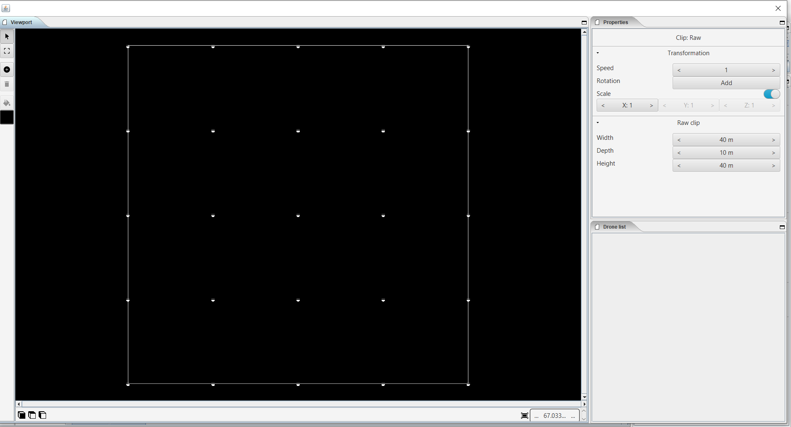

===========================
4. Edit figure
===========================

4.1 Viewport
-------------

*In this section you will find tools to edit, modify or remove the previously placed drones from the start page. The difference with the viewport of the start page is that here you have the option to select and edit a single drone within a formation.*

4.1.1 Arrow
  
  *With the arrow you can select one or more drones, use the shift key to select multiple drones separately.*

  .. image:: images/pijl.jpg

4.1.2 Four corners icon

  *First select with the arrow all the drones you want to edit => then click on the quadrilateral icon => a frame will appear around the outer drones of your selection. These drones are connected by a dotted line. On the four outer corners are anchor points that can be dragged. You can rotate, enlarge or reduce the frame.*

  .. image:: images/Vier_hoeken.jpg

4.1.3 Plus icon

  *With this tool you can add extra drones to your formation layout. First select the desired color in the color area, this is set to black by default and will therefore not be visible. Then click on the plus icon => click in the black field to place additional drones. Use the visualization cube pads to place drones in the depth.*

  .. image:: images/plusteken.jpg

4.1.4 Eraser icon

  *Select one or more drones (shift key) you want to remove => click on the eraser icon => the selection will be removed.*

  .. image:: images/gom.jpg

4.1.5 Bucket

  *Is used to give one or more drones a specific color => select one or more drones => choose the desired color => click on the bucket => the color of the selected drones will be adjusted automatically.*

  .. image:: images/emmer.jpg

4.1.6 Color area

  *Here you can choose a desired color from a suggested color range, or you can create a color yourself via the link.*

  .. image:: images/Color1.jpg

  4.1.6.1 Custom color

  *Here you have the option to compose a color yourself according to the RGB color code or the web color code, hue, saturation, brightness and opacity can also be adjusted here.*

  .. image:: images/Color2.jpg

  .. image:: images/Color3.jpg

  .. image:: images/Color4.jpg

4.1.7 Cube icon

  *Three different perspectives are possible, front view, side view and top view. You can also use the directional arrows on your keyboard to freely define and rotate the perspective, which is very useful for complex structures. Method: first click with the mouse in the black part where the layout is visualized, then use the directional arrows.*

  .. image:: images/cubus.jpg

4.1.8 Outlining icon

  *Use this button if your layout is not fully visualized, the layout will be automatically resized until it fits in the visualization area. You can also use the three lines that frame the "View" area. Click with the mouse pointer on the lines and drag as desired.*

  .. image:: images/kadrage.jpg

4.1.9 Visualisation in terms of percentage

  *You can also reduce, enlarge or fit the visualization of your layout by entering the desired percentages.*

  .. image:: images/percent.jpg

4.2 Properties

  *In this panel you can enter limited presets.*

  .. image:: images/properties_figure.jpg

4.2.1 Transformation

  4.2.1.1 Speed

  *With this function you can speed up or slow down the selected clip or scene, depending on your choice, the block in the timeline will become longer or shorter.*

  4.2.1.2 Rotation

  *First click on the "add" button to activate this function. You can create an unlimited number of rotation buttons and combine them with each other. This function allows you to rotate a layout within a clip or scene in three different axes. The "front" axis: the layout will rotate frontally around its center. The "side" axis, the layout will rotate around its center through its side view. The "top" axis, the layout will rotate around its vertical center axis. The values ​​are expressed in degrees, which you can enter manually or use the arrows. If you press the red box with a cross next to the degrees, your setting will be deleted.*

  4.2.1.3 Scale X Y Z

  *With this function you can enlarge or reduce your layout. If the slider on the right is on, so it has a blue color, the scaling will be done proportionally according to the X, Y, Z axis. You can also choose to scale according to a single axis, then you have to turn off the slider. You can enter the values ​​numerically or use the arrows. When resizing, make sure that the drones do not get too close to each other, otherwise the layout cannot be performed for safety reasons. You can check this via the menu bar => view => drone closeness indicator.*

4.2.2 Raw clip

  *Here you can adjust the work field in which all the drones are located. the changes are immediately visible in the white frame around the drones.*

  4.2.2.1 Width

  *Here you adjust the distance, expressed in meters.*

  4.2.2.2 Depth

  *Here you adjust the depth, expressed in meters. Use the last cube to get a side view of your adjustments.*

  4.2.2.3 Height

  *Here you adjust the height, expressed in meters.*

4.3 Drone list

  *xxxxxxxxxxxxxxxxxxxxxxxx*

  .. image:: images/Dronelistfigure.jpg
  

