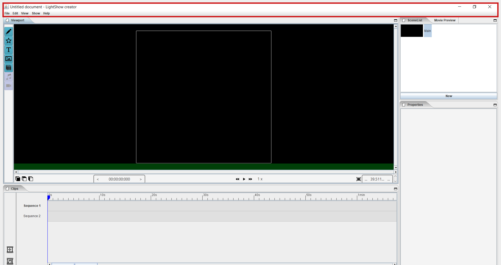

==========================
3 Start page
==========================

3.1 Menu bar
---------------

*The menu bar contains functions related to opening and saving files, project settings, undo edits, extra view options, upload and export options.*

3.1.1 File

  .. image:: images/file.jpg

  - New: 
  
    *Create a new document for the editing layout of a light show.*
  
  - Open
  
    *To open an existing layout.*
  
  - Open recent
  
    *List of your 20 most recently saved formatting documents.*
    
  - Save
  
    *To save your layout.*
    
  - Save as
  
    *Brings up a prompt to save your work as a file with a different name.*
    
  - Settings

    *This function is used to determine the flight zone in which the drones must travel. the width, dept, height and above ground are displayed in meters.*

    - Width
      
      *Expressed in meters*
      
    - Depth
      
      *Expressed in meters*
      
    - Height
      
      *Expressed in meters*
      
    - Above ground
    
      *Expressed in meters*
      
    - Background images
    
      *xxxxxxxxxxxxxxxxx*
      
    - Default drone size
    
      *xxxxxxxxxxxxxxxxxx*

3.1.2 Edit

 .. image:: images/edit.jpg

 - Undo
  
   *Undo an action or operation.*
    
 - Redo
  
   *Redo an action or operation*
    
3.1.3 View

 .. image:: images/view.jpg

 - Drone frames
  
   *You can choose whether or not the frame of the drone is shown in the visualization.*
    
 - Drone closseness indicator
  
   *Function that indicates with a red block above the drone when the drones are placed too close to each other,and this cannot be performed in reality.*
    
 - Scale drone
  
   *xxxxxxxxxxxxxxxxxxxx*

 - Background images
  
   *xxxxxxxxxxxxxxxxxxxxxx*
    
3.1.4 Show

 .. image:: images/show.jpg

 - Upload
  
   *Function where an existing layout can be uploaded in your current layout.*
    
 - Export indoor
  
   *Function whereby a layout for outdoor drones can be exported to a layout for indoor light shows with specific settings.*
    
3.1.5 Help

 .. image:: images/Help.jpg

 - About
  
   *For asking questions in case of problems.*
   
3.2 Viewport
---------------

*In this section you will find the tools to place and select drones within a layout. The placed drones can be visualized in different positions in a simulation using an in and out zoom function. It is also possible to follow the timeline numerically and possibly to slow down or speed up the time.*

3.2.1 Pen

 *Used to manually draw and place drones. When activated, you get a new panel (edit figure) => first choose a color => then click on the plus sign in the left side => click in the field, a drone will appear.*

3.2.2 Star

 *If you click on this, a clip will automatically appear on the timeline without a panel appearing. This clip automatically contains a grid, at the bottom right of the interface at properties you can adjust the grid to your liking in terms of design and number of drones. When the clip is created in the timeline => right mouse button => edit actions for more options*
 
3.2.3 Text

 *When using the text icon, a clip will automatically appear in the timeline. Then go to "properties" => text => enter the desired text and parameters.*
 
3.2.4 Image

 *For placing an image. Note the image must be in black / white (duotone) with a transparent background (PNG format). => click on the icon => a clip will appear => right colon => image none => click and place image.*
 
3.2.5 Book icon

 *Library with existing scenes to choose from. Note, an existing layout to be placed in a new layout must first be saved in the "Library folder" before it is available for posting.*
 
3.2.6 Music icon

 *For placing audio files. Note, you must first place a "music sequence" in the timeline before you can place the audio.*
 
3.2.7 Camera icon

 *xxxxxxxxxxxxxxxxxxxxxxxxx*
 
3.2.8 Cube icons

 *Three different perspectives are possible, front view, side view and top view. You can also use the directional arrows on your keyboard to freely define and rotate the perspective, which is very useful for complex structures. Method: first click with the mouse in the black part where the layout is visualized, then use the directional arrows.*
 
3.2.9 Chrono time

 *This time indication shows the position of the cursor needle in hours, minutes, seconds and milliseconds. If you move the cursor manually, the chrone will be adjusted automatically. The reverse way can also be used if you have to place the cursor very precisely, then enter the correct time indication to place the cursor very accurately.*
 
3.2.10 Play buttons

 *The left button is used to automatically return the cursor needle to the beginning of the layout. The middle button is used to play the format. The right button is used to automatically move the cursor needle to the end of the markup, that is, at the end of the last block on the sequence line*

3.2.11 1x

 *Dit is de versnellingsfunctie, normale snelheid is 1x, hoe hoger het getal hoe sneller op opmaak word afgespeeld.*
 
3.2.12 Outlining icon

 *Use this button if your layout is not fully visualized, the layout will be automatically resized until it fits in the visualization area. You can also use the three lines that frame the "View" area. Click with the mouse pointer on the lines and drag as desired.* 
 
3.2.13 Visualisation in terms of percentage

 *You can also reduce, enlarge or fit the visualization of your layout by entering the desired percentages.*
 
3.3 Clips
---------------

*A sequence is a horizontal space on the timeline where a markup block can be placed. You can create as many sequences vertically one below the other as needed for the intended end result. You can create a new sequence by clicking on the icon for new sequence to the left of the timeline or by dragging a format block down. A sequence is only intended for formatting and not for placing audio files.*

3.3.1 Timeline

 *This is the area where clips and scenes are placed on the sequence tracks and the audio files on the audio sequence. The timeline is therefore a collection of clips and scenes that together form a layout. You can also zoom in and out on the sequence timeline to make the blocks bigger or smaller => place the cursor on the numerical indication and roll the mouse wheel to enlarge or reduce.*
 
3.3.2 Cursor needle

 *The blue cursor needle always indicates the position of the visualization in the layout timeline. The needle can always be moved manually, but it is also magnetic, which means that if you drag a markup block to a different position, the needle will move along and move magnetically and take up position at the right end of that block. You can also adjust the position of the cursor needle in the clock in the viewport, by adjusting the values ​​the needle will take the position, this can be useful if you have to work in milliseconds. When placing a new markup block, the block will always be placed where the cursor needle is located. Note, it may be that there is not enough space next to the needle to place a new block because it has, for example, a very long time zone. in that case select a new sequence line that is still free to place the block.*
 
3.3.3 Sequence

 *A sequence is a horizontal space on the timeline where a markup block can be placed. You can create as many sequences vertically one below the other as needed for the intended end result. You can create a new sequence by clicking on the icon for new sequence to the left of the timeline or by dragging a format block down. A sequence is only intended for formatting and not for placing audio files. With the right mouse button you can change the name of the sequence.*
 
3.3.4 Audio sequence

 *This is the same as the regular sequence but only intended for placing audio files. This makes it easy to synchronize image and audio with each other. With the right mouse button you can change the name of the audio sequence.*
 
3.3.5 Sequence icon

 *To create a new sequence track in the timeline. You can also drag a clip or scene down to create unlimited and automatic new sequence jobs.*
 
3.3.6 Audio sequence icon

 *To create a new audio sequence track in the timeline. You can also drag an audio clip down to create unlimited and automatic new audio sequence jobs.*
 
3.3.7 Clip and scene cubes

 *A clip is a block that you place on the sequence track via the pen or star tool and contains x number of drones in a formation that are bound to a certain time duration. You cannot edit a newly placed clip directly with "edit figure", it must first be converted (via right mouse button) to a raw file (convert into raw). Other options such as edit actions, take a snapshot or delete are available via the right mouse button without converting the clip to raw. A collection of different clips on the timeline can be saved as a scene. For more information see below at scene list.*

3.4 Scene list
---------------

*A collection of different clips on a timeline that is saved as a separate block is called a scene. At "scene list" all created scenes are listed.*

3.4.1 Main

 *When starting a new layout (= new document), the program will always automatically place a "main scene" in the "scene list". This is a blank scene in which the clips are automatically placed. The main scene can always be copied, exported or deleted. Use the right mouse button for this. The intention of the main scene, however, is that all other scenes come together here and serve as the main scene. It is best to create a new scene at the start of your edit, give it a name, place your clips in it and then import them into the "main scene". A scene containing clips can therefore be imported into another scene where it can be combined with other clips and scenes ... so these can be used interchangeably.*
 
3.4.2 New

 *To create a new scene => select the new scene from the list => go to properties to change the name. At "used drones" you can see how many drones are present in your scene. Note this number can be divided over several clips.*
 
3.5 Movie preview
------------------

 *xxxxxxxxxxxxxxxxxxxxx*

3.6 Properties
------------------

*Enter parameters here at the beginning of your layout to obtain the desired result. Note, always select your posted clip or scene first to use the properties. If this is not selected, you cannot see anything in properties. When all parameters are entered as desired, the clip must be converted to a RAW clip => right mouse button => convert into raw => the last part of the properties window "formation" will then change to "RAW clip". The RAW clip can then be adjusted in width, depth and height.*
 
3.6.1 General
 
  - Drones
  
    *Displays the number of drones placed in the clip or scene.*
   
  - Start
  
    *Displays the time when the clip or scene starts on the timeline, expressed in milliseconds. If you change this value, the clip or scene will jump in the timeline.*
   
  - Duration
  
    *Displays the duration of the clip or scene on the timeline, expressed in milliseconds. If you change these values, the block of the clip or scene will become longer or shorter.*
   
  - Position X Y Z
  
    *Here you can adjust the position of the placed drones in your clip or scene according to three axes. The X axis is left, right, the Y axis is forward, backward, and the Z axis is up and down.*
   
  - Remove
  
    *With this button you delete the selected clip or scene in the timeline.*
 
3.6.2 Transformation
 
  - Speed
  
    *With this function you can speed up or slow down the selected clip or scene, depending on your choice, the block in the timeline will become longer or shorter.*
   
  - Rotation
  
    *First click on the "add" button to activate this function. You can create an unlimited number of rotation buttons and combine them with each other. This function allows you to rotate a layout within a clip or scene in three different axes. The "front" axis: the layout will rotate frontally around its center. The "side" axis, the layout will rotate around its center through its side view. The "top" axis, the layout will rotate around its vertical center axis. The values ​​are expressed in degrees, which you can enter manually or use the arrows. If you press the red box with a cross next to the degrees, your setting will be deleted.*
   
  - Scale X Y Z
  
    *With this function you can enlarge or reduce your layout within a clip or scene. If the slider on the right is on, so it has a blue color, the scaling will be done proportionally according to the X, Y, Z axis. You can also choose to scale according to a single axis, then you have to turn off the slider. You can enter the values numerically or use the arrows. When resizing, make sure that the drones do not get too close to each other, otherwise the layout cannot be performed for safety reasons. You can check this via the menu bar => view => drone closeness indicator.*
   
3.6.3 Action
 
  - Edit action

    *With this button you automatically go to the edit actions menu, this is the same if you select your clip or scene in the timeline and use the right mouse button to go to edit actions. In the nemu of edit actions you can enter colors and movements, among other things.*

3.6.4 Formation
 
  - Color
  
    *Choose the color you want for your layout. Please note, this way you give a color to the entire layout of drones. If you want to give a single drone a color you have to go through "Edit figure". You can determine a color in different ways. The first option is to enter a # code (= web color). You can also choose the colors range, => click on the white box => you will get a colors range to choose from. A third way is the "custom color" at the bottom of the colors range, if you click on this you will get an extra window in which you can choose between HSB color, RGB color or a web color again.*
   
  - Mode
 
    *In mode you will find pre-programmed figurations that you can automatically place as a clip on the timeline. This is actually the very first step you need to take to get started on your design.*
 
  - Single drone
  
    *Place a single drone.*
  
  - Grid
  
    *Place a grid of rows and colons.*
       
    - 5 rows
     
      *Enter the number of rows.*
     
    - 5 cols
     
      *Enter the number of columns.*
  
    - Horizontal spacing
     
      *Enter the horizontal space between 2 drones, expressed in meters.*

    - Vertical spacing
     
      *Enter the vertical space between 2 drones, expressed in meters.*
     
    - Rotation
     
      *To rotate your layout around its center, expressed in degrees.*
     
    - Plane
     
      - XZ plane
          
        *Place your layout according to the XZ axis.*
          
      - XZ plane
          
        *Place your layout according to the YZ axis.*
          
      - YZ plane
          
        *Place your layout according to the XY axis.*
         
  - Circle
  
    *For placing a circle.*
       
    - Drone count
     
      *Enter the number of drones that form the circle.*

    - Radius
     
      *The radius of the circle, determines the size of the circle.*

    - Rotation
     
      *To rotate your layout around its center, expressed in degrees.*

  - Rectangle
  
    *For placing a rectangle.*
       
    - 5 Rows
     
      *Enter the number of rows.*

    - 5 Cols
     
      *Enter the number of columns.*

    - Horizontal spacing
     
      *Enter the horizontal gap between 2 drones, expressed in meters.*

    - Vertical spacing
     
      *Enter the horizontal gap between 2 drones, expressed in meters.*

    - Radius
     
      *The radius of the rectangle, determines the size of the rectangle.*

    - Plane
     
      - XZ plane
          
        *Place your layout according to the XZ axis.*

      - YZ plane
          
        *Place your layout according to the YZ axis.*
        
      - XY plane
          
        *Place your layout according to the XY axis.*

  - Sphere
  
    *For placing a 3D sphere.*
       
    - Drone count
     
      *The number of drones forming the sphere.*
    
    - Radius
     
      *The radius of the sphere, determines the size of the sphere.*

  - Polygon
  
    *For placing a polygon where you can determine the number of sides.*
       
    - Drone count
     
      *The number of drones per side of the polygon.*

    - Radius
     
      *The radius of the polygon, determines the size of the polygon.*

    - Side
     
      *The number of sides that make up the polygon.*

  - Star
  
    *To place a star-shaped figure, determine the number of sides yourself.*
       
    - Drone count
     
      *The number of drones per side of the star.*

    - Radius
     
      *The radius of the star, determines the size of the star.*

    - Side
     
      *The number of sides that make up the star.*

          
          
